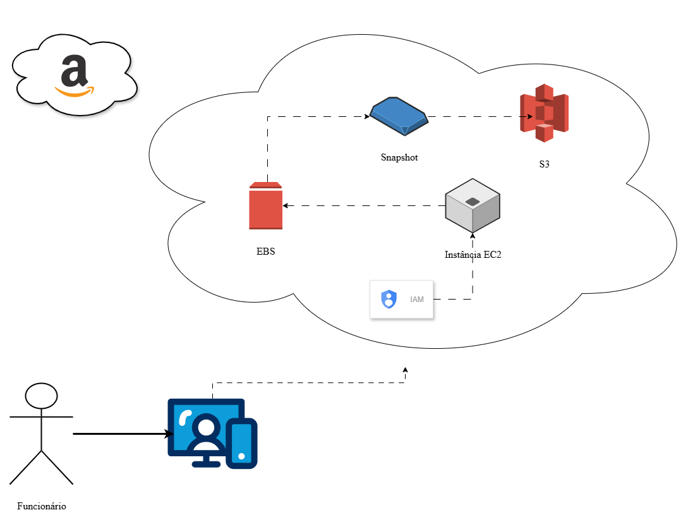
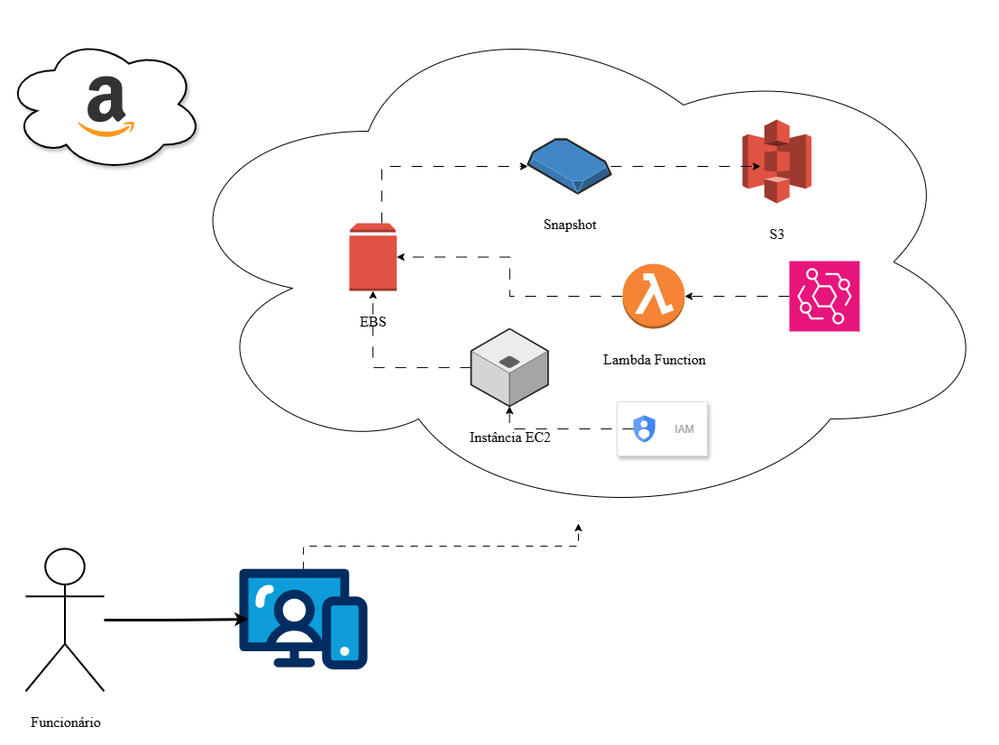

# ☁️ **Challenge - AWS EC2 Instance Management**

 AWS Bootcamp Code Girls 2025

 

        Software architecture project challenge from the Santander Code Girls 2025 Bootcamp, in partnership with DIO.
This repository presents two practical scenarios involving EC2 instance management. The architecture diagrams were created using DRAWIO.

## 🎯 Objectives

        Consolidate the knowledge acquired during the Bootcamp regarding EC2 instance management, as well as snapshots, AMI, EBS, S3, and Lambda functions.

* Create a snapshot from an EC2 instance and store it in S3

- Create an automated snapshot using a Lambda function and store it in S3

* Organize and publish a repository documenting the knowledge acquired through practical experience on GitHub

## 📝 Overview - EC2 Instance Management

        EC2 instance management in AWS involves creating, configuring, monitoring, and maintaining virtual servers in the cloud. Through the AWS Console or automation using scripts and tools such as the AWS CLI, users can launch instances with different types and sizes, adjust resources according to demand, apply security policies using security groups and IAM roles, and monitor performance with CloudWatch. In addition, it is possible to integrate EBS volumes for storage, configure load balancers with ELB, and implement automatic scaling strategies using Auto Scaling Groups. All of this provides flexibility, control, and efficiency for applications in production or testing environments.

        The first diagram focuses on the process of manually creating a snapshot and storing it in S3, including the required IAM permissions, the snapshot creation in EBS, and its export to S3. The second diagram focuses on an automated process, from IAM permissions to the configuration of the Lambda function and its workflow for creating an EBS snapshot and backing it up to S3.

---

	Non-Automated Snapshot Flow Diagram
  

## 📐 Proposed Architecture

Components involved:

* Amazon EC2 → instance that uses the EBS volume.
* Amazon EBS → volume attached to the EC2 instance.
* EBS Snapshot → created backup.
* Amazon S3 → exports snapshots for external storage.
* IAM Roles/Policies → provide permissions to access EC2/EBS/S3.

### 🔄 **Flow Description - Diagram 1**

1. Access IAM and start the EC2 instance.
2. Create a snapshot of the EBS volume attached to it.
3. Export the snapshot to S3 (in *.vmdk* or *.raw* format, using the *ExportTask* service).
4. Grant Lambda access to EC2/EBS/S3 through IAM roles/policies and configure Lambda for automation.

---

	Automated Snapshot Flow Diagram
  

## 📐 Proposed Architecture

Components involved:

* Amazon EventBridge (CloudWatch Events) → schedules the execution (e.g., every day at 2 AM).
* AWS Lambda → function responsible for creating the snapshot.
* Amazon EC2 → instance that uses the EBS volume.
* Amazon EBS → volume attached to the EC2 instance.
* EBS Snapshot → automatically created backup.
* Amazon S3 → used to export snapshots for external storage.
* IAM Roles/Policies → provide Lambda with permissions to access EC2/EBS/S3.

### 🔄 **Flow Description - Diagram 2**

1. EventBridge triggers the Lambda function at the configured time.
2. Lambda uses the AWS SDK (boto3 in Python, for example) to call *create_snapshot()* on the EBS volume.
3. EBS generates a snapshot stored in the region.
4. A temporary AMI is created from the snapshot.
5. The AMI is used to create an export task that saves the image to S3 in *.vmdk* format (a virtual machine disk format).
6. Lambda then exports the snapshot to S3, where the snapshot is stored.

---

### ✅ Conclusion and Lessons Learned

        Based on the architecture shown in the first diagram, the integration between EC2, EBS, S3, and IAM makes it possible to create snapshots and export them in open formats for external storage, ensuring data portability and protection. By configuring appropriate permissions through IAM Roles/Policies and incorporating AWS Lambda for automation, the process becomes scalable and eliminates the need for manual intervention. This approach not only optimizes resources but also strengthens cloud infrastructure governance and reliability.

        The architecture shown in the second diagram offers several strategic benefits. Automation is comprehensive, with all processes executed through AWS Lambda, eliminating the need for manual actions. Scalability is ensured because Lambda operates on demand, adapting to the volume of requests without unnecessary resource usage. In terms of cost efficiency, EC2 instances can be configured and activated only when necessary, and Lambda itself can be configured to shut them down after use, optimizing costs. Security is strengthened through snapshots stored in Amazon S3, using versioning and KMS-managed encryption. Finally, portability is ensured through exports in open formats such a

